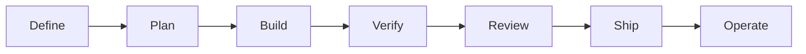
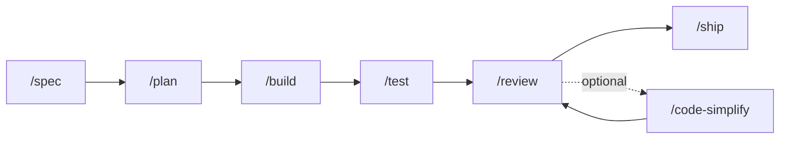
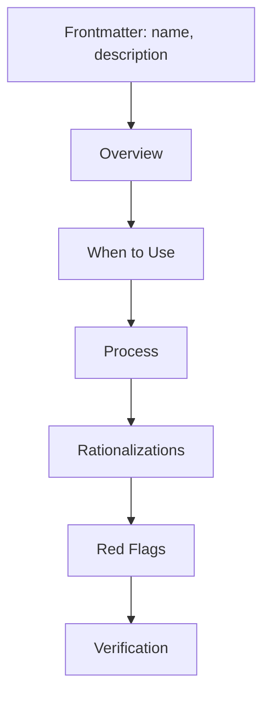

# Agent Protocols

**Structured engineering protocols that make AI coding agents work like senior engineers.**

Most AI agents generate plausible code. These protocols make them generate _correct_ code with specs, tests, reviews, and deployment gates enforced at every step. Each protocol encodes a specific engineering discipline as a repeatable, verifiable workflow.





---

## Table of Contents

- [Visual lifecycle](#visual-lifecycle)
- [Why This Exists](#why-this-exists)
- [Quick Start](#quick-start)
- [Commands](#commands)
- [Protocols](#protocols)
- [Agent Personas](#agent-personas)
- [Reference Checklists](#reference-checklists)
- [How Protocols Work](#how-protocols-work)
- [Project Structure](#project-structure)

---

## Why This Exists

AI coding agents have a consistency problem. They can write code, but they skip tests, ignore edge cases, rationalize away quality steps, and produce changes that look right but break in production.

Agent Protocols solves this by encoding the practices that experienced engineers follow instinctively -- spec before code, test before merge, measure before optimize -- into structured workflows that agents follow deterministically.

**What makes this different:**

- **Anti-rationalization tables.** Every protocol includes a table of excuses agents commonly use to skip steps ("I'll add tests later", "This is too simple for a spec") paired with factual rebuttals. The agent can't talk itself out of doing the work.
- **Verification is mandatory.** Every protocol ends with evidence requirements -- not "seems right" but "tests pass", "build succeeds", "no security warnings". The agent must prove it.
- **Progressive context loading.** Protocols load on-demand based on what the agent is doing. No context window bloat. The right protocol activates at the right time.

---

## Quick Start

### Claude Code

**From the marketplace (recommended):**

```bash
claude /plugin install agent-protocols
```

**From source:**

```bash
claude /plugin marketplace add arneesh/agent-protocols
claude /plugin install agent-protocols@agent-protocols
```

### Cursor

Copy any skill you need from `skills/` into `.cursor/rules/`. See [Cursor setup guide](docs/cursor-setup.md).

### GitHub Copilot

Use agent definitions from `agents/` as Copilot personas and protocol content in `.github/copilot-instructions.md` See [Copilot setup guide](docs/copilot-setup.md)

### Any Agent

Paste the content of any `SKILL.md` into your agent's system prompt, rules file, or conversation context. Protocols are plain Markdown -- they work anywhere.

---

## Commands

Seven slash commands map directly to the development lifecycle. Each activates the right protocols automatically.

| Phase    | Command          | Principle               | What Happens                                                                    |
| -------- | ---------------- | ----------------------- | ------------------------------------------------------------------------------- |
| Define   | `/spec`          | Spec before code        | Writes a PRD with objectives, structure, testing strategy, and boundaries       |
| Plan     | `/plan`          | Small, atomic tasks     | Decomposes the spec into verifiable tasks with acceptance criteria              |
| Build    | `/build`         | One slice at a time     | Implements in thin vertical slices with tests at every step                     |
| Verify   | `/test`          | Tests are proof         | Runs the TDD workflow -- red, green, refactor                                   |
| Review   | `/review`        | Improve code health     | Five-axis review: correctness, readability, architecture, security, performance |
| Simplify | `/code-simplify` | Clarity over cleverness | Reduces complexity while preserving exact behavior                              |
| Ship     | `/ship`          | Faster is safer         | Pre-launch checklist, staged rollout, monitoring setup                          |

Protocols also activate contextually -- designing an API triggers `api-and-interface-design`, building UI triggers `frontend-ui-engineering`, debugging triggers `debugging-and-error-recovery`.

---

## Protocols

25 protocols organized by development phase. Each is a structured workflow with steps, verification gates, and anti-rationalization tables. Use them through commands or reference any protocol directly.

### Define

| Protocol                                                           | Purpose                                                                              | Trigger                                                |
| ------------------------------------------------------------------ | ------------------------------------------------------------------------------------ | ------------------------------------------------------ |
| [idea-refine](skills/idea-refine/SKILL.md)                         | Structured divergent/convergent thinking to turn vague ideas into concrete proposals | Rough concept that needs exploration                   |
| [spec-driven-development](skills/spec-driven-development/SKILL.md) | PRD covering objectives, commands, structure, code style, testing, and boundaries    | Starting a new project, feature, or significant change |

### Plan

| Protocol                                                                   | Purpose                                                                                       | Trigger                                                             |
| -------------------------------------------------------------------------- | --------------------------------------------------------------------------------------------- | ------------------------------------------------------------------- |
| [planning-and-task-breakdown](skills/planning-and-task-breakdown/SKILL.md) | Decompose specs into small, verifiable tasks with acceptance criteria and dependency ordering | Spec exists and needs implementable units                           |
| [research-spike-and-poc](skills/research-spike-and-poc/SKILL.md)           | Timeboxed technical exploration with evidence and proceed/pivot/stop recommendation           | Choosing libraries, proving feasibility, unknown integration effort |

### Build

| Protocol                                                                                       | Purpose                                                                                      | Trigger                                                            |
| ---------------------------------------------------------------------------------------------- | -------------------------------------------------------------------------------------------- | ------------------------------------------------------------------ |
| [incremental-implementation](skills/incremental-implementation/SKILL.md)                       | Thin vertical slices -- implement, test, verify, commit with feature flags and safe defaults | Any change touching more than one file                             |
| [test-driven-development](skills/test-driven-development/SKILL.md)                             | Red-Green-Refactor with test pyramid (80/15/5), test sizes, and the Beyonce Rule             | Implementing logic, fixing bugs, or changing behavior              |
| [context-engineering](skills/context-engineering/SKILL.md)                                     | Feed agents the right information at the right time via rules files and MCP integrations     | Starting a session, switching tasks, or when output quality drops  |
| [source-driven-development](skills/source-driven-development/SKILL.md)                         | Ground every framework decision in official docs -- verify, cite, flag what's unverified     | Working with any framework or library                              |
| [frontend-ui-engineering](skills/frontend-ui-engineering/SKILL.md)                             | Component architecture, design systems, state management, responsive design, WCAG 2.1 AA     | Building or modifying user-facing interfaces                       |
| [api-and-interface-design](skills/api-and-interface-design/SKILL.md)                           | Contract-first design, Hyrum's Law, error semantics, boundary validation                     | Designing APIs, module boundaries, or public interfaces            |
| [internationalization-and-localization](skills/internationalization-and-localization/SKILL.md) | i18n/l10n: keys, ICU plurals, RTL, locale formats, pseudo-localization                       | Multiple languages, regional formats, or translated user-facing UI |

### Verify

| Protocol                                                                       | Purpose                                                                                   | Trigger                                             |
| ------------------------------------------------------------------------------ | ----------------------------------------------------------------------------------------- | --------------------------------------------------- |
| [browser-testing-with-devtools](skills/browser-testing-with-devtools/SKILL.md) | Chrome DevTools MCP for live runtime data -- DOM, console, network, performance profiling | Building or debugging anything in a browser         |
| [debugging-and-error-recovery](skills/debugging-and-error-recovery/SKILL.md)   | Five-step triage: reproduce, localize, reduce, fix, guard with stop-the-line rule         | Tests fail, builds break, or behavior is unexpected |

### Review

| Protocol                                                             | Purpose                                                                                         | Trigger                                                           |
| -------------------------------------------------------------------- | ----------------------------------------------------------------------------------------------- | ----------------------------------------------------------------- |
| [code-review-and-quality](skills/code-review-and-quality/SKILL.md)   | Five-axis review, ~100-line changes, severity labels, review speed norms                        | Before merging any change                                         |
| [code-simplification](skills/code-simplification/SKILL.md)           | Chesterton's Fence, Rule of 500, reduce complexity while preserving exact behavior              | Code works but is harder to read/maintain than it should be       |
| [karpathy-guidelines](skills/karpathy-guidelines/SKILL.md)           | Behavioral guardrails against LLM coding pitfalls -- think first, simplify, be surgical, verify | Writing, reviewing, or refactoring code with an AI agent          |
| [security-and-hardening](skills/security-and-hardening/SKILL.md)     | OWASP Top 10, auth patterns, secrets management, dependency auditing                            | Handling user input, auth, data storage, or external integrations |
| [performance-optimization](skills/performance-optimization/SKILL.md) | Measure-first -- Core Web Vitals, profiling workflows, bundle analysis                          | Performance requirements exist or regressions suspected           |

### Ship

| Protocol                                                                   | Purpose                                                                          | Trigger                                                    |
| -------------------------------------------------------------------------- | -------------------------------------------------------------------------------- | ---------------------------------------------------------- |
| [git-workflow-and-versioning](skills/git-workflow-and-versioning/SKILL.md) | Trunk-based development, atomic commits, ~100-line changes, commit-as-save-point | Making any code change                                     |
| [ci-cd-and-automation](skills/ci-cd-and-automation/SKILL.md)               | Shift Left, feature flags, quality gate pipelines, failure feedback loops        | Setting up or modifying build/deploy pipelines             |
| [deprecation-and-migration](skills/deprecation-and-migration/SKILL.md)     | Code-as-liability, compulsory vs advisory deprecation, migration patterns        | Removing old systems or sunsetting features                |
| [documentation-and-adrs](skills/documentation-and-adrs/SKILL.md)           | Architecture Decision Records, API docs, inline standards -- document the _why_  | Architectural decisions, API changes, or shipping features |
| [shipping-and-launch](skills/shipping-and-launch/SKILL.md)                 | Pre-launch checklists, staged rollouts, rollback procedures, monitoring          | Preparing to deploy to production                          |

### Operate

| Protocol                                                                               | Purpose                                                                     | Trigger                                                       |
| -------------------------------------------------------------------------------------- | --------------------------------------------------------------------------- | ------------------------------------------------------------- |
| [incident-response-and-postmortems](skills/incident-response-and-postmortems/SKILL.md) | Live incident triage, stabilize, communicate, recover, blameless postmortem | Production outage, SLO breach, on-call alert, customer impact |

### Meta

| Protocol                                                 | Purpose                                                                  | Trigger                                              |
| -------------------------------------------------------- | ------------------------------------------------------------------------ | ---------------------------------------------------- |
| [using-agent-skills](skills/using-agent-skills/SKILL.md) | Skill discovery flowchart -- maps task types to the appropriate protocol | Starting a new task and unsure which protocol to use |

---

## Agent Personas

Specialized agent configurations for targeted analysis. Load a persona when you need a specific engineering perspective.

| Persona                                                        | Role                  | What It Evaluates                                                       |
| -------------------------------------------------------------- | --------------------- | ----------------------------------------------------------------------- |
| [Code Reviewer](agents/code-reviewer.md)                       | Senior Staff Engineer | Five-axis code review with "would a staff engineer approve this?" bar   |
| [Test Engineer](agents/test-engineer.md)                       | QA Specialist         | Test strategy, coverage gaps, the Prove-It pattern, test quality        |
| [Security Auditor](agents/security-auditor.md)                 | Security Engineer     | Vulnerability detection, threat modeling, OWASP Top 10 assessment       |
| [Performance Engineer](agents/performance-engineer.md)         | Performance Engineer  | Measure-first analysis, profiling, Core Web Vitals, latency regressions |
| [Documentation Specialist](agents/documentation-specialist.md) | Technical Writer      | ADRs, API docs, runbooks, accuracy vs code                              |
| [Release Engineer](agents/release-engineer.md)                 | Platform / SRE        | CI/CD gates, staged deploys, rollback, launch readiness                 |
| [Accessibility Specialist](agents/accessibility-specialist.md) | A11y Engineer         | WCAG 2.1 AA, keyboard and screen reader flows, inclusive UI             |
| [Spec Analyst](agents/spec-analyst.md)                         | Product Engineer      | PRD quality, scope boundaries, testable acceptance criteria             |

---

## Reference Checklists

Supplementary material that protocols pull in on demand. These provide detailed patterns without bloating the core protocol files.

| Reference                                                           | Covers                                                                     |
| ------------------------------------------------------------------- | -------------------------------------------------------------------------- |
| [testing-patterns.md](references/testing-patterns.md)               | Test structure, naming, mocking, React/API/E2E examples, anti-patterns     |
| [security-checklist.md](references/security-checklist.md)           | Pre-commit checks, auth, input validation, headers, CORS, OWASP Top 10     |
| [performance-checklist.md](references/performance-checklist.md)     | Core Web Vitals targets, frontend/backend checklists, measurement commands |
| [accessibility-checklist.md](references/accessibility-checklist.md) | Keyboard nav, screen readers, visual design, ARIA, testing tools           |

---

## How Protocols Work

Every protocol follows a consistent structure designed for AI agent consumption:

```
SKILL.md
  Frontmatter          name + description (used for discovery)
  Overview             What this protocol does and why it matters
  When to Use          Triggering conditions and exclusions
  Process              Step-by-step workflow with checkpoints
  Rationalizations     Excuses agents use to skip steps + rebuttals
  Red Flags            Observable signs the protocol is being violated
  Verification         Evidence requirements -- tests, builds, runtime data
```



---

## Project Structure

```
agent-protocols/
├── skills/                              # 25 engineering protocols
│   ├── idea-refine/                     #   Define
│   ├── spec-driven-development/         #   Define
│   ├── planning-and-task-breakdown/     #   Plan
│   ├── research-spike-and-poc/          #   Plan
│   ├── incremental-implementation/      #   Build
│   ├── test-driven-development/         #   Build
│   ├── context-engineering/             #   Build
│   ├── source-driven-development/       #   Build
│   ├── frontend-ui-engineering/         #   Build
│   ├── api-and-interface-design/        #   Build
│   ├── internationalization-and-localization/ # Build
│   ├── browser-testing-with-devtools/   #   Verify
│   ├── debugging-and-error-recovery/    #   Verify
│   ├── code-review-and-quality/         #   Review
│   ├── code-simplification/             #   Review
│   ├── security-and-hardening/          #   Review
│   ├── performance-optimization/        #   Review
│   ├── karpathy-guidelines/             #   Review
│   ├── git-workflow-and-versioning/     #   Ship
│   ├── ci-cd-and-automation/            #   Ship
│   ├── deprecation-and-migration/       #   Ship
│   ├── documentation-and-adrs/          #   Ship
│   ├── shipping-and-launch/             #   Ship
│   ├── incident-response-and-postmortems/ # Operate
│   └── using-agent-skills/              #   Meta
├── agents/                              # Specialist personas (review, QA, security, perf, docs, release, a11y)
├── references/                          # 4 supplementary checklists
├── hooks/                               # Session lifecycle hooks
├── .claude/commands/                    # 7 slash commands
└── docs/                                # Setup guides
```

---

## License

MIT
